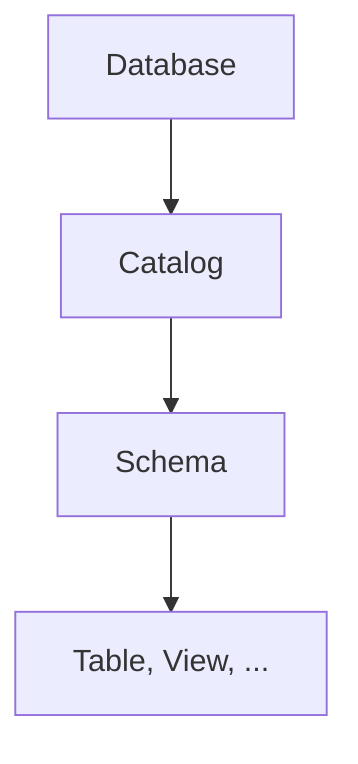

# Week 4-5 : Intermediate SQL & Advanced SQL

---

[SQL part1](03_Class.md)  

- [1. Join Expressions](#1-join-expressions)
    - [1.1. The Natural Join](#11-the-natural-join)
    - [1.2. Join Conditions](#12-join-conditions)
    - [1.3. Outer Joins](#13-outer-joins)
    - [1.4. Summary](#14-summary)
- [2. Views](#2-views)
    - [2.1. View Definition](#21-view-definition)
    - [2.2. Views Defined Using Other Views](#22-views-defined-using-other-views)
    - [2.3. Comparison](#23-comparison)
    - [2.4. Effect](#24-effect)
    - [2.5. Attention](#25-attention)
- [3. Transactions](#3-transactions)
    - [3.1. Commit and Rollback Work](#31-commit-and-rollback-work)
- [4. Integrity Constraints](#4-integrity-constraints)
    - [4.1. Use Integrity Constraints](#41-use-integrity-constraints)
    - [4.2. Constraints on a Single Relation](#42-constraints-on-a-single-relation)
    - [4.3. Not Null Constraint](#43-not-null-constraint)
    - [4.4. Unique Constraint](#44-unique-constraint)
    - [4.5. The Check Clause](#45-the-check-clause)
    - [4.6. Referential Integrity](#46-referential-integrity)
        - [4.6.1. Cascade](#461-cascade)
        - [4.6.2. Other Actions](#462-other-actions)
    - [4.7. Assigning Names to Constraints](#47-assigning-names-to-constraints)
    - [4.8. Integrity Constraint Violation During a Transaction](#48-integrity-constraint-violation-during-a-transaction)
    - [4.9. Assertion](#49-assertion)
- [5. SQL Data Types and Schemas](#5-sql-data-types-and-schemas)
    - [5.1. Date and Time Types in SQL](#51-date-and-time-types-in-sql)
    - [5.2. Type Conversion and Formatting Functions](#52-type-conversion-and-formatting-functions)
    - [5.3. Default Values](#53-default-values)
    - [5.4. Large-Object Types](#54-large-object-types)
    - [5.5. User-Defined Types](#55-user-defined-types)
    - [5.6. Generating Unique Key Values](#56-generating-unique-key-values)
    - [5.7. Create Table Extensions](#57-create-table-extensions)
    - [5.8. Schemas, Catalogs, and Environments](#58-schemas-catalogs-and-environments)
- [6. Authorization](#6-authorization)
    - [6.1. Granting and Revoking of Privileges](#61-granting-and-revoking-of-privileges)
    - [6.2. Roles](#62-roles)
- [7. *Advanced SQL*](#7-advanced-sql)
    - [7.1. Access SQL From a Programming Language](#71-access-sql-from-a-programming-language)
    - [7.2. Functions and Procedural Constructs](#72-functions-and-procedural-constructs)
    - [7.3. Triggers](#73-triggers)

---

## 1. Join Expressions

"join" operations allow us to write some queries in a more natural way  
and to express some queries that are hard to do with only the Cartesian product  

### 1.1. The Natural Join

unlike Cartesian product, witch concatenates all tuples of two relations  
**natural join** only does concatenation to those pairs of tuples with the same values on those attributes appear in both relations' schemas  
besides, it eliminates duplicate attributes in the result  
that is, the attributes in both schemas only appear once in the result  

**basic format:**  
$r_1$ **natural join** $r_2$  

so we can do such conversion from earlier SQL to natural join:  

```sql
select name, course_id
from student, takes
where student.ID = takes.ID;
```

to

```sql
select name, course_id
from student natural join takes;
```

However, natural join above is based on the name of attributes in two relations  
it is not difficult to imagine that the situation where two relations have the same attribute name but different meaning may occur  

e.g. student relation and course relation both have attribute `dept_name`  
the former one is the department of the student while the latter one is the department name of the course  
if we do natural join on these two relations, we will get a result that is not what we want  
so the construct of natural join which allows us to specify the attributes to be joined is provided  

**format with specified equated attributes:**  
$r_1$ **join** $r_2$ **using** ($a_1, ... , a_n$)  

### 1.2. Join Conditions

Above natural join is very useful but it without doubt has its limitation  
to put join operation to general use, we need to define a more general join operation  
SQL provides **join ... on** to do this  

**format:**  
$r_1$ **join** $r_2$ **on** $p$  

where $p$ is a predicate on the attributes of $r_1$ and $r_2$  
*$p$ is very similar to **where** clause*  

**Attention:**  
unlike natural join, this join does not eliminate duplicate attributes  

### 1.3. Outer Joins

**natural join** dose not include tuples that do not satisfy the join condition  
but sometimes we want to include those tuples  
so **outer join** is provided to do this  
that is to say, natural join may drop some tuples that not satisfy the join condition  
but outer join will keep them by filling the missing values with nulls  
*In contrast, we can call the join above **inner-join**, which drop the unmatched tuples*  
*In other word, we do inner-join by default*  

- **left outer join**  
    preserve tuples from the left relation  
- **right outer join**  
    preserve tuples from the right relation  
- **full outer join**  
    preserve tuples from both relations  

use outer join:  
replace `join` with the type of outer join and keep other part of the join operations  

### 1.4. Summary

- join types
    - inner join
    - left outer join
    - right outer join
    - full outer join
- join conditions
    - natural
    - on \<predicate\>  
    - using ($A_1,A_2,...,A_n$)  

## 2. Views

View is a virtual table based on the result-set of an SQL statement  
**It doesn't create a new table, it presents a virtual relation generated by SQL expression on existing relations**  
*Similar to the macro in C*  

In other word  
**view** conceptually contains the tuples in the query result  
but it is note precomputed and stored  
it is stored as the SQL query expression  

### 2.1. View Definition

**command:**
**create view**  

**format:**  
**create view** $v$ **as** \<query expression\> ;

- $v$ : name of the view(must be provided and unique)  
- \<query expression\> : any legal SQL expressions  

example:  

```sql
create view view_name as
select column_name1, column_name2, ...
from table_name
where condition;
```

### 2.2. Views Defined Using Other Views

**Dependent Definition of View:**  
Definition of a view can also have view in its query expression  

**Dependence Type:**  

- depend directly on  
- depend on  
- recursive

### 2.3. Comparison

**Compare `view` with `with`**  
`with` clause use a subquery to define a temporary view  
but it is limited to the scope of the query including the `with` clause  
while `view` remain available once created until explicitly dropped  

**Compare `view` with directly store the result relation**  
`view` is a virtual relation, it is computed on demand  
if we store the result relation, it may become out of date when the base relations change  

### 2.4. Effect

1. simplify complex SQL query by using view to represent the relation generated by internal query  
2. restrict the viewable content in some way  

### 2.5. Attention

Most SQL implementations allow updates only on simple views  
*Actually, this corresponds the idea of view: just view!*  

## 3. Transactions

**transaction**  
consists of a sequence of query and/or update statements  
(similar to the script file in shell)  

### 3.1. Commit and Rollback Work

A transaction must be ended with one of the following commands:  

- **commit work**  
    commit the current transaction  
    permanentize the updates performed by the transaction  
- **rollback work**  
    undo the updates performed by the transaction  
    back to the state before the transaction started  

*keyword work is optional*  

## 4. Integrity Constraints

**Integrity Constraints**
ensure that changes made to the database by authorized users  
do not result in  a loss of data consistency  

normal examples:  

1. **not null**  
2. **unique**  
3. **primary key**
4. **foreign key**  

### 4.1. Use Integrity Constraints

normally, **Integrity Constraints** are identified as part of the schema  
and declared when **create table**  

they can also be added to an existing table by  
**alter table** $t$ **add** $constraint$  

### 4.2. Constraints on a Single Relation

- **not null**  
- **unique**  
- **check**(\<predicate\>)  

### 4.3. Not Null Constraint

format:  
$a_1$ **type** **not null**  

### 4.4. Unique Constraint

format:  
**unique**($A_{j_1},A_{j_2},...,A_{j_n}$)  

means that the values of $A_{j_1},A_{j_2},...,A_{j_n}$ must be unique  
in other word, it forms a superkey of the relation  

*Note that $null$ values are allowed by default and not considered to be equal*  

### 4.5. The Check Clause

format:  
**check**(\<predicate\>)  

a **check** clause may appear on its own(after all the attribute definition)  
or as part of the definition of an attribute(after the type)  

although the predicate allows any expression in theory  
most database products don't allow subqueries in the predicate  
(it costs too much to check)  

### 4.6. Referential Integrity

format:  
**foreign key** ($A_{j_1},A_{j_2},...,A_{j_n}$) **references** $t$  
or  
**foreign key** ($A_{j_1},A_{j_2},...,A_{j_n}$) **references** $t$($A_{k_1},A_{k_2},...,A_{k_m}$)  

- $t$ : the name of the referenced relation  
- **Attention:**  
    - the foreign key attributes must be a superkey of the referenced relation  
        that is, must be constrained by **primary key** or **unique**  
    - number and data types of attributes must by compatible with the corresponded attributes  

also, we can put the constraint right after the attribute definition:  
$A_i$ **type** **references** $t$  

#### 4.6.1. Cascade

when we use **foreign key**, but we may want to modify the referenced relation  
normally the database system will not allow us to do this  
cause it will break the referential integrity leaving the referencing relation inconsistent  
SQL provides a way to define the action to be taken when the referenced relation is modified  

**cascade(传递):**  

- **on delete cascade**  
- **on update cascade**  

by using **cascade**  
the modification of the referenced relation will be cascaded to the referencing relation  

#### 4.6.2. Other Actions

- **set null**  
    set the foreign key attributes to null  
- **set default**  
    set the foreign key attributes to default value  

### 4.7. Assigning Names to Constraints

we are allowed to assign a name to integrity constraints  
it is very useful when we want to drop a constraint defined previously  

**format:**  
**constraint** $c\_name$ **the constraint**  

### 4.8. Integrity Constraint Violation During a Transaction

there will be a situation where the integrity constraint is violated during a transaction, but a later step may remove the violation  

**initially deferred** is provided to handle this question  
it means the constraint would by checked at the end of a transaction instead of at immediate steps  

### 4.9. Assertion

**before introduction:**  
assertion may not be supported by some database systems  
and it may cost huge overhead, so use it with great caution!!!  

**assertion** is a predicate that must be true at all times  

format:  
**create assertion** \<assertion-name\> **check** \<predicate\>;  

it can by implemented using triggers  

## 5. SQL Data Types and Schemas

what we talk above only use the built-in data types  
here we learn about the basic user-defined types in SQL  

### 5.1. Date and Time Types in SQL

page 154  

### 5.2. Type Conversion and Formatting Functions

systems perform some data type **conversions** automatically  
but others need to be requested explicitly  

**format:**  
**cast** ($e$ **as** $t$)  

- $e$ : expression  
- $t$ : target data type  

### 5.3. Default Values

### 5.4. Large-Object Types  

### 5.5. User-Defined Types

### 5.6. Generating Unique Key Values

### 5.7. Create Table Extensions

### 5.8. Schemas, Catalogs, and Environments

three-level hierarchy  



for the naming of the table, it is very similar to the package in Java  

## 6. Authorization

types of authorizations:  

- read data
- insert data  
- update data  
- delete data  

### 6.1. Granting and Revoking of Privileges

SQL standard:  

- **select**  
- **insert**  
- **update**  
- **delete**  
- **all privileges**  

to grant privileges to user/role  
**basic command format:**  
**grant** \<privilege list\>  
**on** \<relation name or view name\>  
**to** \<user/role list\>  

to revoke privileges from user/role  
**basic command format:**  
**revoke** \<privilege list\>  
**on** \<relation name or view name\>  
**from** \<user/role list\>  

### 6.2. Roles

---

## 7. *Advanced SQL*

### 7.1. Access SQL From a Programming Language

### 7.2. Functions and Procedural Constructs

### 7.3. Triggers
