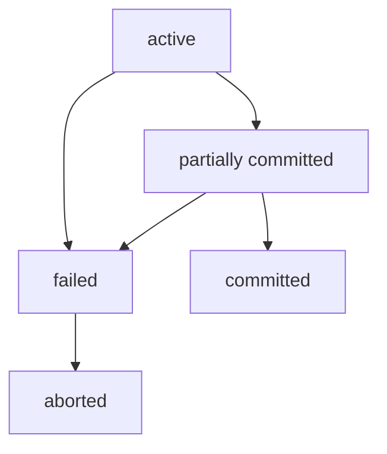
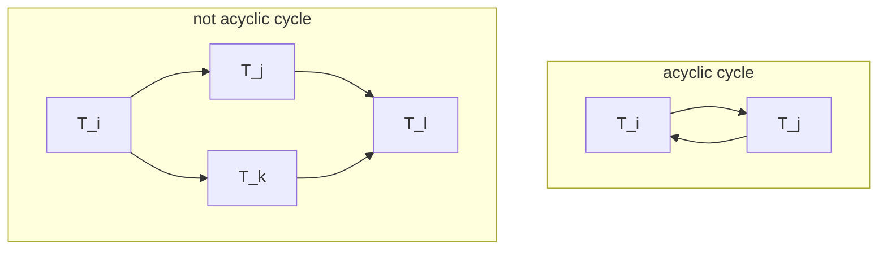
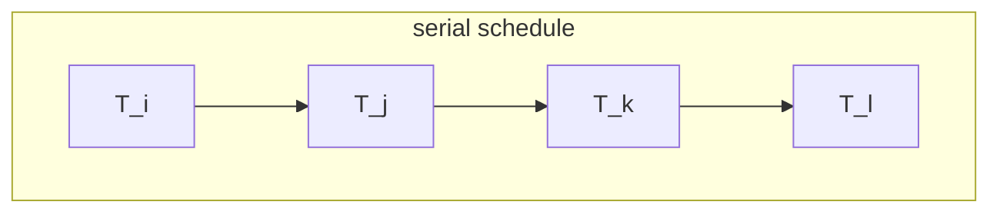

# Transactions

## 1. Concept

transaction: a unit of program execution that accesses and possibly updates various data items  

a transaction must see a consistent database  

after commit, hte changes to the database should persist  
even if there are system failures  

multiple transactions can execute concurrently  

## 2. ACID

ACID:  

- **Atomicity**: a transaction is all or nothing  
- **Consistency**: a transaction must leave the database in a consistent state  
- **Isolation**: each transaction must be unaware of other concurrently executing transactions  
- **Durability**: if a transaction completes successfully, the changes it has made to the database persist(even if there are system failures)  

## 3. Transaction State(事物状态)

totally 5 states:  

- active: initial state  
    the transaction should stays in this state while it's executing  
- partially committed: after the final statement has been executed  
  
- Failed: after error occurs in the transaction so it has to stop  

- aborter: after the transaction has been rolled back  
    and the database restored to its state prior to the start of the transaction  

- committed: after successful completion  

## 4. Concurrent Executions

why we need concurrent executions?  

- better performance!  
- better resource utilization!  

the problem is that how we keep the consistency of the database?  
so we need **concurrency control schemes**  
which are the mechanisms to achieve isolation  

### 4.1. Schedules(调度)

schedule: a sequence of instructions that specify the chronological order(时间顺序) how the transactions' instructions are executed  

### 4.2. Serial Schedules(串行调度)

`Serial` means that the transactions are executed only when another transaction has completed  

this of course confirms the consistency  
but is not efficient  

so we may want to try to optimize the schedule  
but how?

### 4.3. Serializability(串行性)

basic assumption:  
each transaction preserves database consistency  

**serializability:** a (possibly concurrent) schedule is serializable if it is equivalent to a serial schedule  

different forms:  

- **conflict serializability**
- **view serializability**

*attention: we simplified the schedules to only include read and write instructions*  

### 4.4. Conflict Serializability(冲突串行性)

first we should know the concept **conflicting instructions**  

#### 4.4.1. Conflicting Instructions

let $I_i$ and $I_j$ be two instructions in $T_i$ and $T_j$ respectively  

$I_i$ and $I_j$ are conflicting if and only if there exists some item Q accessed by both $I_i$ and $I_j$  
and at least one of them is a write to Q  

so we can conclude that:  

1. $I_i = \text{read}(Q) and I_j = \text{read}(Q)$  
    $I_i$ and $I_j$ not conflicting  
2. $I_i = \text{read}(Q) and I_j = \text{write}(Q)$  
    $I_i$ and $I_j$ are conflicting  
3. $I_i = \text{write}(Q) and I_j = \text{read}(Q)$  
    $I_i$ and $I_j$ are conflicting  
4. $I_i = \text{write}(Q) and I_j = \text{write}(Q)$  
    $I_i$ and $I_j$ are conflicting  

the fact that two instructions are conflicting forces a (logical) temporal order between them  

and on the other hand, if two instructions are not conflicting, they can be executed in any order  

#### 4.4.2. Conception

**conflict equivalent:**  
if a schedule $S$ can be transformed into a schedule $S'$ by a series of swaps of non-conflicting instructions, then $S$ and $S'$ are **conflict equivalent**  

**conflict serializable:**  
schedule $S$ is conflict serializable if it is conflict equivalent to some serial schedule  

### 4.5. View Serializability(视图串行性)

#### 4.5.1. View Equivalent

**view equivalent:**  
let $S$ and $S'$ be two schedules with the same set of transactions  
they are view equivalent if the following conditions are met:  

1. $T_i$ reads the initial value of $Q$ in $S$, then in $S'$ it should do the same  
2. $T_id$ executes read($Q$) which was produced by $T_j$ in schedule $S$, then in $S'$ it should do the same  
3. $T_i$ performs final write($Q$) in $S$, then in $S'$ it should do the same  

view equivalence is also based purely on reads and writes alone.  

#### 4.5.2. View Serializability

similar to conflict serializability, a schedule $S$ is view serializable if it is view equivalent to some serial schedule  

every conflict serializable schedule is also view serializable  
but not vice versa  

### 4.6. Other Notions of Serializability(其他串行性)

some schedules are neither conflict serializable nor view serializable  
but they are still serializable  

at this time, we need analysis of operations other than read and write  

### 4.7. Testing for Serializability

#### 4.7.1. Precedence Graph(优先图)

a directed graph where the vertices are the transactions  

we draw an arc from $T_i$ to $T_j$ if $T_i$ and $T_j$ are conflicting  
*in other words, the order is fixed*  
the direction is decided by the temporal order of the conflicting instructions  
if there are bidirectional arcs(denoted by two arcs, each one is one directed), the the two transactions is not acyclic  

we may label an arc by the item that was accessed  

if some transaction has no conflict with any other transaction, it can not by in the precedence graph  

#### 4.7.2. Test for Conflict Serializability

a schedule is conflict serializable  
if and only if its precedence graph is acyclic(无环)  
*attention this cycle is the cycle between two transactions!*  

*additionally, we can use a easy way to understand the acyclic concept: we may go back to the vertices which has been gone through along the direction of the arc*  

we can topologically sort the acyclic graph to get a serializable schedule  

*e.g. the not acyclic cycle above can be sorted to the following schedule:*  

*the $T_j$ and $T_k$ can be swapped as they are not conflicting*  

### 4.8. Recoverable Schedules(可恢复调度)

following several concepts is to specify the domain of the effect of transaction failures on concurrently running transactions  

#### 4.8.1. Concept

**Recoverable schedule:**  
if a transaction $T_i$ reads a data item  
which was previously written by another transaction $T_j$,  
then the commit operation of $T_i$ must appear before  
the commit operation of $T_j$  

database must ensure that schedules are recoverable  

### 4.9. Cascading Rollbacks(级联回滚)

**Cascading rollback:**  
a single transaction failure leads to a series of transaction rollbacks  

this can lead to the undoing of a significant amount of work  

### 4.10. Cascadeless Schedules(无级联调度)

**Cascadeless schedule:**  
the schedule in which the cascading rollback can't occur  

#### 4.10.1. Condition

for each pair of transactions $T_i$ and $T_j$,  
if $T_j$ reads a data item $Q$ previously written by $T_i$,  
the **commit** operation of $T_i$ must appear before the **read** operation of $T_j$  

#### 4.10.2. Conclusion

every cascadeless schedule is recoverable  

it is desirable to restrict the schedules to be cascadeless!  

### 4.11. Concurrency Control

A database must provide a mechanism to ensure that  
all schedules are:  

- either conflict or view serializable  
- recoverable and preferably cascadeless  

**goal:**  
to develop concurrency control protocols that will assure serializability  

## Weak Levels of Consistency

some times we may not need the strong consistency  
in other word, we may allow weaker consistency to have better performance  

in a word, we may:  
tradeoff accuracy for performance  

### Levels of Consistency in SQL-92

- serializable: default
- repeatable read  
- read committed  
- read uncommitted  

## Transaction Definition in SQL
