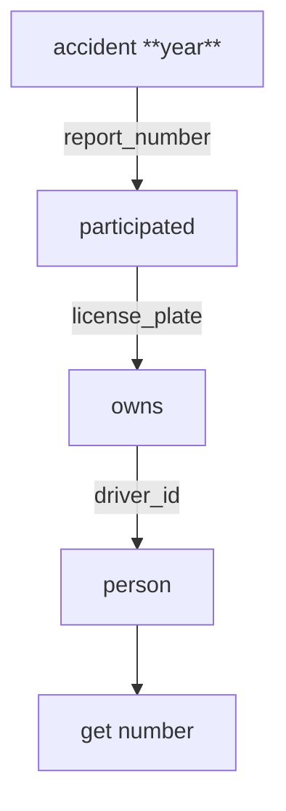
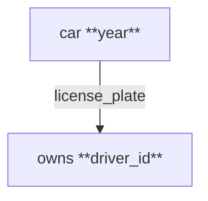
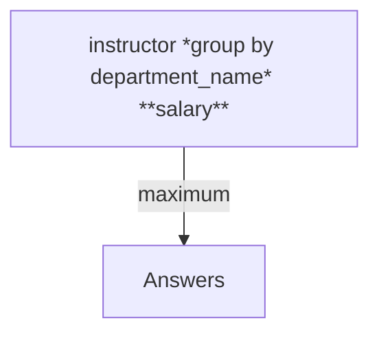
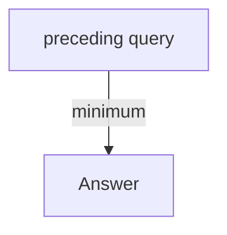
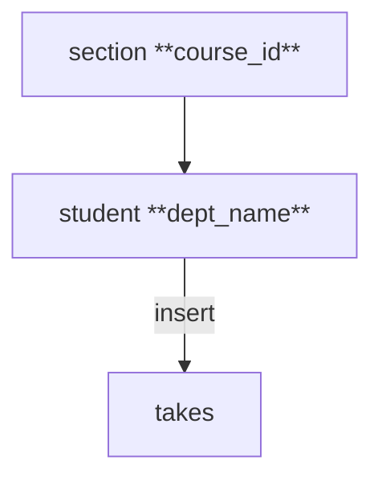
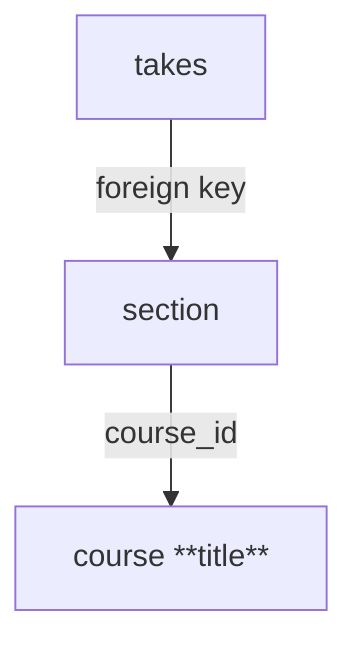
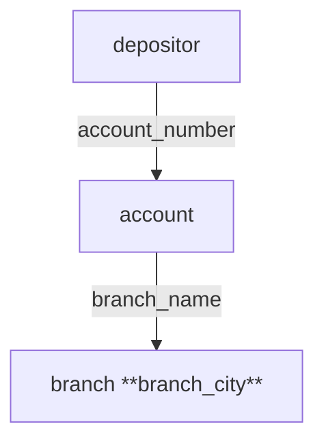

# HW 2

P116-121, 176-180, 236  

- 3.4  
- 3.11 c,d  
- 3.12 b,c,e,f  
- 3.15 a,c
- 3.30
- 4.3 b
- 4.18
- 4.25
- 5.19

## 1. 3.4

### 1.1. a

total number of people

1. owned cars
    1. cars have accidents in 2017



```sql
SELECT COUNT(DISTINCT person.driver_id) AS total_people
FROM (SELECT report_number,
             year
      FROM accident
      WHERE year = "2017") AS a  
      NATURAL JOIN participated
      JOIN owns ON participated.license_plate = owns.license_plate
      JOIN person ON owns.driver_id = person.driver_id
```

### 1.2. b

do: DELETE

who: car

1. cars year 2010
    1. owned by person id "12345"



```sql
DELETE FROM car
WHERE license_id IN (
    SELECT license_plate
    FROM (SELECT *
        FROM owns
        WHERE driver_id = "12345")
        JOIN car ON car.license_plate = owns.license_plate
        WHERE car.year = "2010"
    )
```

## 2. 3.11 c,d

### 2.1. c

what: salary
from: instructor  
by: department

maximum salary of instructors  
each department  



```sql
SELECT dept_name, MAX(salary) AS max_salary
FROM instructor
GROUP BY dept_name
```

### 2.2. d

lowest per-dept maximum salary of instructors



```sql
WITH dept_max_salary AS (
    SELECT dept_name, MAX(salary) AS max_salary
    FROM instructor
    GROUP BY dept_name
)
SELECT MIN(max_salary) AS lowest_max_salary
FROM dept_max_salary
```

## 3. 3.12 b,c,e,f

### 3.1. b

do: insert  
what: section  
content:  

1. course_id "CS-001"  
2. sec_id 1
3. semester "Fall"
4. year 2017
5. rest null

```sql
INSERT INTO section
VALUES ("CS-001", 1, "Fall", 2017, NULL, NULL, NULL)
```

### 3.2. c

do: enroll
what: student
how:

1. all students in Comp. Sci. department
2. to above section



```sql
INSERT INTO takes
SELECT ID, course_id, sec_id, semester, year
FROM student,
    (SELECT course_id, sec_id, semester, year
    FROM section
    WHERE course_id = "CS-001" AND sec_id = 1 AND semester = "Fall" AND year = 2017) AS s
WHERE dept_name = "Comp. Sci."
```

### 3.3. e

the integrity may be violated  
because the sections should also be deleted for the course is no longer exists

in fact, here we can see that the `sections` have a foreign key constraint on `course_id` in `course`  
most DBMS will automatically delete the sections when the course is deleted  
and the takes will be deleted too  

### 3.4. f

do: delete  
what: takes  
how:  

1. section to the course  
2. course title has "advanced"  
3. no matter case



```sql
DELETE FROM takes
WHERE (course_id, sec_id, semester, year) IN
    (SELECT course_id, sec_id, semester, year
    FROM (SELECT course_id
        FROM course
        WHERE title LIKE "%advanced%") AS c
        NATURAL JOIN section)
```

## 4. 3.15 a,c

### 4.1. a

find: customer  
how:  

1. has an account  
    1. account at **every**  branch in "Brooklyn"  

in based on the relational algebra calculation "divide"  



```sql
WITH brooklyn_branches AS 
    (SELECT branch_name
    FROM branch
    WHERE branch_city = 'Brooklyn')
SELECT DISTINCT ID
FROM depositor AS d
WHERE NOT EXISTS        -- 对每个d的元组的子查询，检查是否有返回的元组，如果有（说明bb的某个元组不再d的对应的account中）则返回false，该d的元组不计入
    (SELECT *
    FROM brooklyn_branches AS bb
    WHERE NOT EXISTS        -- 检查bb的每个元组是否再d的某个元组的对应的account中，没有则返回true，计入返回元组中
        (SELECT *
        FROM account AS a
        WHERE a.account_number = d.account_number
        AND a.branch_name = bb.branch_name))
```

1. consider each tuple d in depositor  
    1. consider each tuple bb in brooklyn_branches  
        check whether there is a tuple a in account  
        1. a belongs to d  
        2. a belongs to bb  

### 4.2. c

find the names of all branched that have assets greater than those of at least one branch located in "Brooklyn"  

find: branch_name  

how:  

1. branch in "Brooklyn" as bb  
2. greater than at least one in bb

```sql
WITH brooklyn_branches(branch_name, assets) AS
    (SELECT branch_name, assets
    FROM branch
    WHERE branch_city = 'Brooklyn')
SELECT DISTINCT b.branch_name
FROM branch AS b
WHERE b.assets > SOME (SELECT assets
                  FROM brooklyn_branches AS bb
                  WHERE bb.branch_name = b.branch_name)
```

## 5. 3.30

if one of the instructors's salary in "null"

assuming there are 10 instructors  
and other instructors have the salary 10000  

then the avg(salary) = 10000  
but sum(salary) / count(*) = 10000 / 9  

then the result would not be 0  

## 6. 4.3 b

SELECT * FROM student NATURAL FULL OUTER JOIN takes  

how to replace this SQL query without using the OUTER JOIN expression?

```sql
(SELECT s.*, t.* 
 FROM student s 
 LEFT JOIN takes t ON s.ID = t.ID)
UNION
(SELECT s.*, t.* 
 FROM student s 
 RIGHT JOIN takes t ON s.ID = t.ID
 WHERE s.ID IS NULL)
```

## 7. 4.18

```txt
employee(**ID**, person_name, street, city)  
works(**ID**, company_name, salary)
company(**company_name**, city)
manages(**ID**, manager_id)
```

find: ID of employee  
how:  

1. employee with no manager  
2. attention the manager may just be null or not listed  

two ways:  

1. using outer join
2. without using outher join

way1:  

```sql
SELECT e.ID
FROM employee e 
LEFT OUTER JOIN manages m ON e.ID = m.ID
WHERE m.manager_id IS NULL OR m.ID IS NULL
```

way2:  

```sql
SELECT ID 
FROM employee
WHERE ID NOT IN (
    SELECT ID 
    FROM manages 
    WHERE manager_id IS NOT NULL
)
```

## 8. 4.25

user u --> create r1  
r1 --> foreign key referencing r2  

what privilege u need on r2?  
why should this not simply be allowed without any such authorization?  

1. REFERENCE privilege  

2. why?  
    1. may cause date leak in r2
    2. if be referenced, the manipulation of r2 may be limited  
    3. foreign keys need many resources to maintain  

## 9. 5.19

Suppose there are two relations r and s, such that the foreign key B of r references
the primary key A of s. Describe how the trigger mechanism can be used to
implement the on delete cascade option when a tuple is deleted from s.

```sql
CREATE TRIGGER cascade_delete
AFTER DELETE ON s
FOR EACH ROW
BEGIN
    -- 从表r中删除所有引用了被删除行的记录
    DELETE FROM r
    WHERE B = OLD.A;
END;
```
