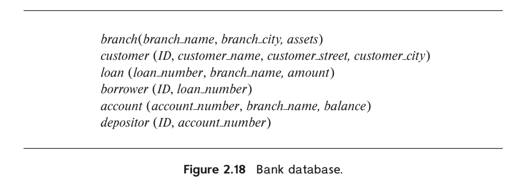
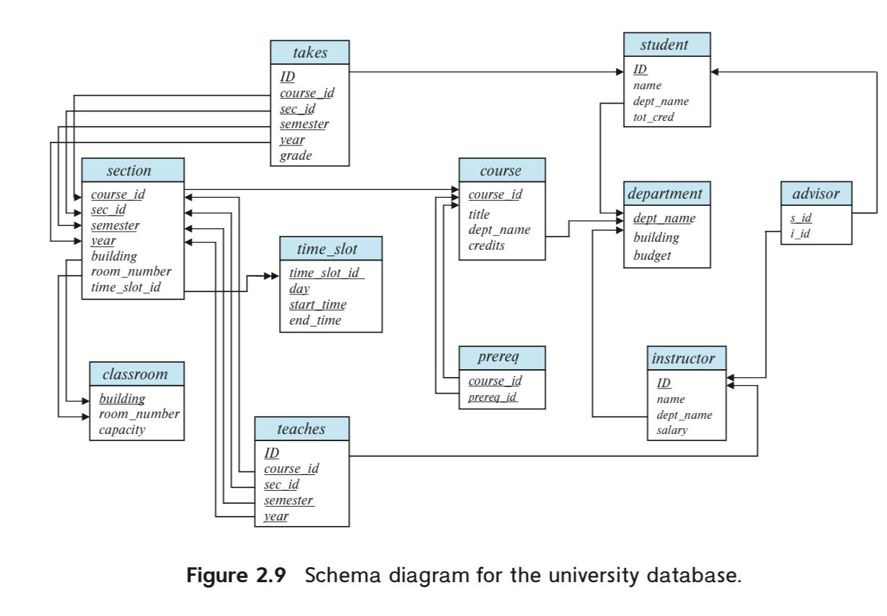

# Homework 1

## 1. `2.7`

ask for relational algebra  

### 1.1. `a`

select name
from branch
where branch is in "Chicago"  

project name ( select branch = "Chicago" ( branch )) 

$$\Pi_{branch\_name}(\sigma_{branch\_city = "Chicago"}(branch))$$

### 1.2. `b`

select ID  
from borrower, loan  
where branch_name = "Downtown"

$$\Pi_{ID}(\sigma_{loan.loan\_number = borrower.loan\_number \land branch\_name = "Downtown"}(borrower \times loan))$$

## 2. `2.9`

### 2.1. `a`

select ID  
from takes, course
where "who have taken all the courses of Comp. Sci."  

cs_courses_id <--  
    select course_id  
    from course  
    where dept_name = "Comp. Sci."

$$cs\_courses\_id \leftarrow \Pi_{course\_id}(\sigma_{dept\_name = "Comp. Sci."}(course))\\(\Pi_{ID,course\_id}(takes))\div cs\_course\_id$$

### 2.2. `b`

$$cs\_courses\_id \leftarrow \Pi_{course\_id}(\sigma_{dept\_name = "Comp. Sci."}(course))\\
id\_course\_id \leftarrow \Pi_{ID,course\_id}(takes)\\
id\_cs\_courses\_id \leftarrow
\Pi_{ID,id\_course\_id.course\_id}\\(\sigma_{id\_course\_id.course\_id = cs\_courses\_id.course\_id}(id\_course\_id \times cs\_courses\_id))\\
not\_completed\_student\_id \leftarrow \Pi_{ID}\\((\Pi_{ID}(takes) \times cs\_courses\_id) - id \_cs\_courses\_id)\\
\Pi_{ID}(id\_cs\_courses\_id) - not\_completed\_student\_id$$

## 3. `2.14 d`

  

select ID, name  
from employee, work, company  
where "lives in the same city as his or her company"  

employee --> person_name, city  
work --> person_name, company_name  
join --> person_name, city, company_name by person_name  

$$\Pi_{name}(\sigma_{employ.city = company.city}((\Pi_{person\_name,city}(employee) \\\bowtie_{employee.person\_name = works.person\_name}\Pi_{person\_name,company\_name}(works)) \\\bowtie_{works.company\_name = company.company\_name} company))
$$

question: there is no `ID` in the relation  

## 4. `2.15 c`

select ID  
from depositor, account  
where branch_name = "Uptown" and balance >= 6000  

$$\Pi_{ID}(\sigma_{balance >= 6000}(depositor \bowtie_{depositor.account\_number = account.account\_number}\\(\sigma_{branch\_name = "Uptown"}(account))))
$$

## 5. `2.18`

  

select ID, name  
from instructor  
where department = "Physics"  

### 5.1. `a`

$$\Pi_{ID,name}(\sigma_{dept\_name = "Physics"}(instructor))
$$

### 5.2. `b`

select ID, name  
from instructor, department  
where building = "Watson"  

$$\Pi_{ID,name}(instructor\bowtie_{instructor.dept\_name = department.dept\_name}\\(\sigma_{building = "Watson"}(department)))
$$

### 5.3. `c`

select ID, name  
from student, takes, course  
where course.dept_name = "Comp. Sci."  

$$taken\_cs_student\_id \leftarrow \Pi_{ID}(\sigma_{dept\_name = "Comp. Sci."}(course)\\\bowtie_{course.course\_id = takes.course\_id}(takes))\\  
\Pi_{ID,name}(taken\_cs\_student\_id \\\bowtie_{student.ID = taken\_cs\_student\_id.ID}(student))
$$

### 5.4. `d`

select ID, name  
from student, 