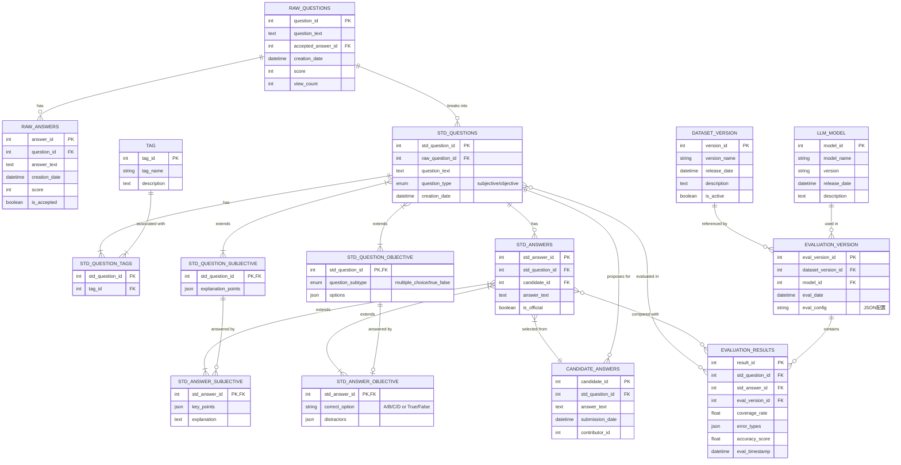

# HPJ 技术问答数据集评测系统 - ER模型设计

## Entity-Relationship Model Diagram



## ER模型设计优势

1. **数据层次分离**：清晰区分原始数据（raw_questions, raw_answers）和标准化数据（std_questions, std_answers），便于数据追溯和质量管理。

2. **问答类型扩展性**：通过继承结构设计（std_question_subjective/objective, std_answer_subjective/objective），优雅处理不同类型问题的特殊属性，无需在基表中维护大量可空字段。

3. **候选答案管理**：引入candidate_answers表作为标准答案的来源池，支持众包答案收集和专家审核流程。

4. **完整的标签系统**：通过多对多关系表（std_question_tags）实现问题的多维度标签管理，便于按类别筛选和统计。

5. **版本化评测**：dataset_version和evaluation_version分离设计，支持同一数据集的多次评测和不同LLM模型间的横向比较。

6. **灵活的评测结果存储**：evaluation_results表关联问题、答案和评测版本，支持复杂查询分析需求。

7. **JSON字段应用**：合理使用JSON类型字段（如key_points, error_types）存储半结构化数据，平衡了结构化查询和灵活性。

8. **查询友好**：设计支持所有需求查询场景，如：
   - 未录入标准答案的问题统计
   - 按问题类型或标签的数据分布
   - 特定模型在特定数据集版本上的评测结果分析

9. **继承关系明确**：通过"extends"关系明确表示子类型表与基表的关系，便于理解数据结构。

10. **业务流程映射**：ER设计直接映射了问题->候选答案->标准答案->评测结果的完整业务流程。

## 需求查询示例实现

以下是针对需求的SQL查询示例：

1. 统计原始问题和标准问题数量：

    ```sql
    SELECT 
        (SELECT COUNT(*) FROM raw_questions) AS raw_questions_count,
        (SELECT COUNT(*) FROM std_questions) AS std_questions_count,
        (SELECT COUNT(*) FROM raw_answers) AS raw_answers_count,
        (SELECT COUNT(*) FROM std_answers) AS std_answers_count;
    ```

2. 查询尚未录入标准答案的标准问题：

    ```sql
    SELECT q.std_question_id, q.question_text, q.question_type
    FROM std_questions q
    LEFT JOIN std_answers a ON q.std_question_id = a.std_question_id
    WHERE a.std_answer_id IS NULL
    ORDER BY q.creation_date;
    ```

3. 按标签统计标准问题数量：

    ```sql
    SELECT t.tag_name, COUNT(qt.std_question_id) AS question_count
    FROM tag t
    JOIN std_question_tags qt ON t.tag_id = qt.tag_id
    GROUP BY t.tag_name
    ORDER BY question_count DESC;
    ```

4. 根据评测版本查询评测结果：

    ```sql
    SELECT m.model_name, AVG(r.coverage_rate) AS avg_coverage, 
        COUNT(DISTINCT r.std_question_id) AS questions_evaluated
    FROM evaluation_results r
    JOIN evaluation_version v ON r.eval_version_id = v.eval_version_id
    JOIN llm_model m ON v.model_id = m.model_id
    WHERE v.dataset_version_id = ?
    GROUP BY m.model_name
    ORDER BY avg_coverage DESC;
    ```
