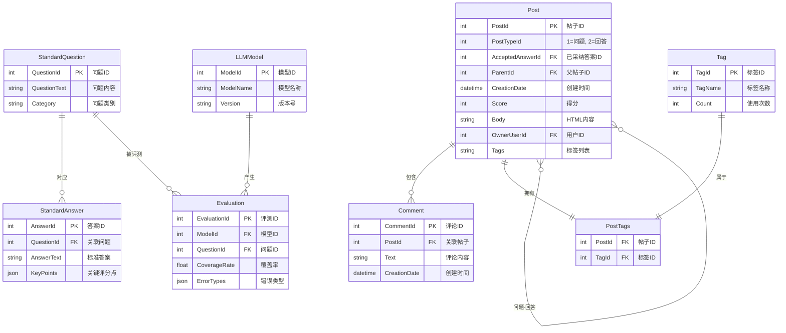

# ERD of HPJ 1

架构说明：
核心实体（来自Stack Exchange）：

Post：区分问题（PostTypeId=1）和回答（PostTypeId=2），通过ParentId关联答案到问题。

Tag：通过中间表PostTags实现多对多关联。

Comment：一对多关联到Post。

评测扩展实体：

StandardQuestion：存储构建的标准问题（如Linux内核相关问题）。

StandardAnswer：每个问题对应一个或多个标准答案（支持众包候选答案）。

LLMModel：记录不同LLM的版本信息。

Evaluation：存储评测结果，包含覆盖率、错误类型等结构化数据。

关键设计点：

使用JSON字段存储动态内容（如评分要点、错误类型）。

通过中间表PostTags实现灵活的标签关联。

标准化评测流程：LLM回答通过Evaluation表与标准答案对比。

可扩展性建议：
添加User表以记录用户贡献（需处理OwnerUserId=-1的特殊情况）。

增加DatasetVersion表管理不同版本的标准问答集。

在Evaluation中添加时间戳字段以支持历史结果追踪。

此设计平衡了原始数据结构和LLM评测需求，可直接用于构建技术问答评测数据库。