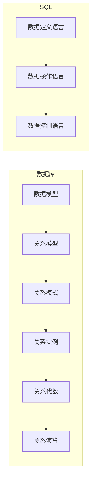

# System Design

## 数据库

```mermaid
flowchart LR
    subgraph DB[数据库]
        A[数据模型] --> B[关系模型]
        B --> C[关系模式]
        C --> D[关系实例]
        D --> E[关系代数]
        E --> F[关系演算]
    end
    subgraph SQL[SQL]
        G[数据定义语言] --> H[数据操作语言]
        H --> I[数据控制语言]
    end
```

原始问答录入  
采纳回答录入  

原始问答-->标准问答  

拆分  

原始问题-->标准问题  
